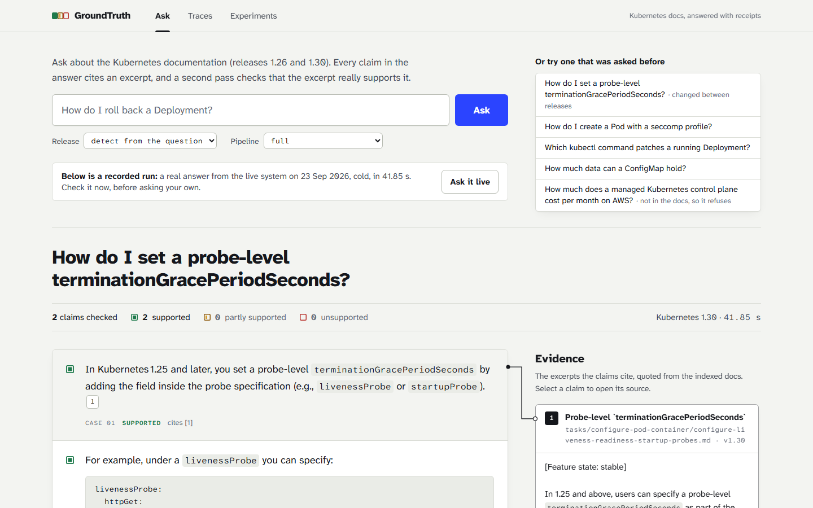

# GroundTruth

A self-evaluating, version-aware RAG platform over the Kubernetes documentation —
built so that every claim it makes about itself can be checked.



> ### Status: measured end to end, audited, $0.00
>
> Every number below is generated from a committed record in `experiments/`,
> each recorded from a clean tree with its config hash, git SHA, gold-integrity
> audit and 95% intervals.
>
> **The most important result is a correction.** The first version of this
> project reported that structure-aware chunking lifted recall@5 from 0.286 to
> 0.786. An audit found the baseline's chunker was storing lowercased,
> space-mangled text, so most gold quotes could not match any baseline chunk.
> Corrected, the dense baseline scores **0.857** on dev — and on this golden set
> no retrieval change (chunking, hybrid search, BM25, reranking) is
> distinguishable from noise. [EXPERIMENTS.md](EXPERIMENTS.md) walks through the
> thirteen measurement defects the audit found and what each did to the numbers.
>
> Read the caveats before the numbers: 32 golden items (14 dev / 10 test with
> gold evidence), a 639-page corpus subset, and an LLM judge that is the same
> model as the answerer, so `correctness` is self-assessed.

## The problem

RAG systems work in the demo and degrade quietly in production. GroundTruth
targets five specific failures, and is built to *measure* whether it fixes each.

| Failure | How this repo addresses it |
|---|---|
| **Unmeasured quality** — changes ship with no evidence | An eval harness built before any retrieval work. Every run is a record with a config hash, git SHA, bootstrap intervals, and a gold-integrity audit; comparisons are paired item by item |
| **Stale and conflicting knowledge** | Release branches indexed side by side; version detection; version filtering in SQL; conflict notes shown beside the answer, never blended into it |
| **Retrieval misses** on exact terms, tables, code | Dense + lexical fused with RRF, where the lexical leg is **BM25 computed in plain Postgres**; chunking that never splits a fenced block or a table |
| **Hallucinated citations** | Per-sentence claim verification against the cited excerpt, with a regenerate-once-then-abstain policy |
| **Undiagnosable failures** | A span per stage (including failed queries), a rank trail per chunk, and six-way failure attribution that separates a retrieval miss from a ranking miss from a generation failure |

## What an audit of the evaluation found

The harness exists to catch wrong numbers, so it was turned on itself. Thirteen
measurement defects, each fixed, regression-tested and re-measured — the ones
that moved published numbers:

- **Chunk text was `tokenizer.decode(ids)`**, which lowercases and spaces out
  punctuation. Only 8 of 26 gold quotes could match any baseline chunk.
- **Recall@10 was computed over the five-chunk context**, so it always equalled
  recall@5.
- **pgvector 0.6.2 filters after the HNSW scan**, so dense retrieval silently
  returned fewer than `k` chunks.
- **The lexical leg required every question term** and read `-o` as NOT; it
  matched nothing for 20 of 32 golden questions.
- **The runner told the pipeline which version to answer from**, making
  "version correctness 1.000" a tautology.

And one that was not about measurement at all: **`.gitignore` had a bare
`models/` that matched `backend/app/models/`**, so the ORM package had never
been committed and no clone of the repo could run. A fresh clone now installs,
passes all 256 tests and builds the frontend.

Each is now guarded: every run audits whether its gold is matchable
(`integrity.recall_ceiling`) and the CI gate fails if it is not.

## Quick start

Requires [uv](https://docs.astral.sh/uv/) and Node 22. No Docker needed.

```bash
cp .env.example .env        # an LLM key is optional: retrieval evals need none
make install
make db-local               # real Postgres 16 + pgvector as a user process
make migrate
make ingest                 # CPU embedding; see below for a faster subset
make eval CONFIG=configs/hybrid_bm25.yaml SPLIT=dev MODE=retrieval
make dev                    # API on :8000
```

Then `cd frontend && npm install && npm run dev` for the UI on `localhost:3000`.

On Windows, `./make.ps1 <target>` mirrors every target. With Docker available,
`make up` starts Postgres and the API in containers instead.

Ingestion is CPU-bound on embedding. The evaluated subset takes ~12 minutes for
both chunkers:

```bash
cd backend
uv run python -m app.ingestion.run --config ../configs/hybrid_bm25.yaml \
    --versions 1.26 1.30 --include concepts tasks
```

| Command | What it does |
|---|---|
| `make check` | Lint, type-check, and test — everything CI runs |
| `make eval` | Run an evaluation and write an experiment record |
| `make compare A=<id> B=<id>` | Paired comparison of two runs, with intervals and p-values |
| `make results` | Regenerate the results table below from `experiments/` |
| `make llm-check` | Verify the configured model before a long generation run |

## How it works

```
fetch → parse → chunk → embed → Postgres (pgvector HNSW + tsvector GIN)
                                       ↓
question → version detect → [rewrite] → [decompose]
                                       ↓
                        dense ─┐
                               ├─ RRF → [rerank] → grounded answer
                   BM25 (SQL) ─┘                         ↓
                                              claim verification
                                                         ↓
                                        return · regenerate once · abstain
```

Every stage is a config toggle, so an experiment is one line of YAML rather than
a code change. [docs/ARCHITECTURE.md](docs/ARCHITECTURE.md) has the diagrams and
twenty recorded decisions, each with its trade-off.

Four ideas do most of the work:

- **Gold evidence is documentation coordinates, not chunk ids** —
  `(source_path, heading_path, version, key_quote)` — so labels survive
  re-chunking. And because a quote that no chunk can contain is a guaranteed
  miss, **every run audits its gold at the chunk level before scoring.**
- **Chunk-set identity covers everything that shapes a vector**, including the
  chunker's implementation revision, so an experiment can never measure an
  index its config did not build.
- **Uncertainty is reported, not described.** Every metric carries a bootstrap
  interval; `make compare` pairs two runs item by item and says whether a
  difference is distinguishable from noise.
- **An uncited factual sentence counts as unsupported.** Otherwise the cheapest
  way to raise the support fraction would be to stop citing.

## Results

<!-- RESULTS_TABLE_START -->
| Config | Dataset | Split | n | Recall@5 (95% CI) | Recall@10 | MRR@10 | nDCG@10 | Correctness (95% CI) | Faithfulness | Citation prec. | p50 | Cost | Commit |
|---|---|---|---|---|---|---|---|---|---|---|---|---|---|
| `baseline` | `golden_v1` | dev | 14 | 0.857 [0.64, 1.00] | 0.857 | 0.538 | 0.713 | — | — | — | 20ms | $0.00 | `3ba204c` |
| `baseline` | `golden_v1` | test | 10 | 0.700 [0.40, 1.00] | 0.900 | 0.603 | 0.671 | — | — | — | 21ms | $0.00 | `3ba204c` |
| `structure_aware` | `golden_v1` | dev | 14 | 0.786 [0.57, 1.00] | 0.786 | 0.500 | 0.781 | — | — | — | 20ms | $0.00 | `3ba204c` |
| `structure_aware` | `golden_v1` | test | 10 | 0.700 [0.40, 1.00] | 0.700 | 0.467 | 0.526 | — | — | — | 20ms | $0.00 | `3ba204c` |
| `hybrid_all_terms` | `golden_v1` | dev | 14 | 0.786 [0.57, 1.00] | 0.786 | 0.583 | 0.842 | — | — | — | 24ms | $0.00 | `3ba204c` |
| `hybrid_all_terms` | `golden_v1` | test | 10 | 0.700 [0.40, 1.00] | 0.700 | 0.517 | 0.563 | — | — | — | 25ms | $0.00 | `3ba204c` |
| `hybrid` | `golden_v1` | dev | 14 | 0.714 [0.50, 0.93] | 0.786 | 0.558 | 0.724 | — | — | — | 71ms | $0.00 | `3ba204c` |
| `hybrid` | `golden_v1` | test | 10 | 0.600 [0.30, 0.90] | 0.700 | 0.502 | 0.559 | — | — | — | 85ms | $0.00 | `3ba204c` |
| `hybrid_bm25` | `golden_v1` | dev | 14 | 0.714 [0.50, 0.93] | 0.786 | 0.572 | 0.850 | — | — | — | 112ms | $0.00 | `3ba204c` |
| `hybrid_bm25` | `golden_v1` | test | 10 | 0.700 [0.40, 1.00] | 0.700 | 0.496 | 0.559 | — | — | — | 111ms | $0.00 | `3ba204c` |
| `hybrid_rerank` | `golden_v1` | dev | 14 | 0.714 [0.50, 0.93] | 0.786 | 0.537 | 0.759 | — | — | — | 7,806ms | $0.00 | `3ba204c` |
| `hybrid_rerank` | `golden_v1` | test | 10 | 0.700 [0.40, 1.00] | 0.900 | 0.592 | 0.676 | — | — | — | 9,621ms | $0.00 | `3ba204c` |
| `full` | `golden_v1` | dev | 14 | 0.786 [0.57, 1.00] | 0.857 | 0.630 | 0.808 | 0.842 [0.68, 1.00] | 0.974 | 1.000 | 261ms† | $0.00 | `0d19599` |
| `full` | `golden_v1` | test | 10 | 0.800 [0.50, 1.00] | 0.900 | 0.625 | 0.701 | 0.923 [0.77, 1.00] | 0.942 | 0.900 | 299ms† | $0.00 | `0d19599` |
| `hybrid` | `fixture_golden` | all | 6 | 0.667 [0.33, 1.00] | 1.000 | 0.621 | 0.706 | — | — | — | 50ms | $0.00 | `3ba204c` |
| `hybrid_bm25` | `fixture_golden` | all | 6 | 1.000 [1.00, 1.00] | 1.000 | 0.833 | 0.877 | — | — | — | 37ms | $0.00 | `40024ee` |

_Generated by `scripts/generate_results_table.py`: the newest run in each of 16 (config, dataset, split, mode) groups in `experiments/`. Do not edit by hand._
_`n` counts items with gold evidence (retrieval metrics); intervals are a 95% percentile bootstrap over items. Recall@k, MRR@10 and nDCG@10 are over the full ranked list; see `context_recall` in each file for the top-`k_final` cut._
_† mostly served from the LLM cache, so this p50 is not a cold-query latency; see EXPERIMENTS.md._
<!-- RESULTS_TABLE_END -->

Read the table through its intervals. On this golden set the dense baseline
over fixed windows is as good as anything, and `make compare` on any pair of
retrieval configs reports *within noise*. The one distinguishable difference in
the repo is the audit's correction itself: the pre-audit baseline against the
corrected one, recall@5 **+0.571** on dev (95% CI [+0.29, +0.86], p = 0.008,
8 items better, 0 worse). `full` correctness is self-judged — see below.
[EXPERIMENTS.md](EXPERIMENTS.md) has every paired comparison and per-category
table, all generated from the records by `scripts/experiment_tables.py`.

## Judge validation

**Not done — the most important remaining caveat.** `answer_correctness` is
`nvidia/nemotron-3-super-120b-a12b` grading answers written by the same model.
Self-evaluation inflates, and nothing yet says by how much.

The machinery is built and tested:

```bash
cd backend
uv run python -m evals.judge.label --count 50   # judge verdicts hidden, to avoid anchoring
uv run python -m evals.judge.label --report     # accuracy + Cohen's kappa
```

The labeler shows the reference answer and the cited excerpts, ties each label
to the exact answer it judged (so a re-run cannot silently reuse stale labels),
and leaves rule-decided abstentions out of kappa. Agreement is reported as
accuracy *and* kappa, because on a set that is 85% correct a judge that always
says "pass" scores 85% accuracy while carrying no information.

## Limitations

Tracked in [docs/LIMITATIONS.md](docs/LIMITATIONS.md) — including the
self-evaluating judge, the small golden set, the corpus subset, pgvector 0.6.2's
post-filtering HNSW scans, and conflict detection being a lexical heuristic.

## Testing and CI

231 unit tests and 25 integration tests, including a from-scratch Python BM25
that the SQL implementation must match to 1e-9, and an end-to-end run of the
evaluation runner over the fixture index. Integration tests run against their own `_test` database — they
truncate tables, so they never touch a corpus you ingested. They skip when no
database is reachable and run in CI against a `pgvector/pgvector:pg16` service.

CI lints, type-checks, tests, ingests the committed fixture corpus, evaluates
the shipping retrieval config on the fixture golden set, and fails if any
tracked metric — or the gold-integrity ceiling — drops below
`evals/thresholds.yaml`. It also fails if this README's results table was
edited by hand. Generation evals are a separate manual workflow.

## Project layout

```
backend/app/        core, ingestion, retrieval, generation, tracing, api
backend/evals/      dataset, metrics (+ stats), judge, attribution, integrity, runner, gate, compare
configs/            the only place a pipeline choice lives
experiments/        one JSON per run (committed); superseded/ holds pre-audit runs
data/golden/        curated golden sets (committed); data/raw is not
frontend/           Next.js: ask, trace viewer, experiments dashboard
docs/               architecture, limitations, demo script
```

## Attribution

The corpus is the [Kubernetes documentation](https://github.com/kubernetes/website)
(`content/en/docs/` from `release-1.26`, `release-1.28`, `release-1.30`), used
under [CC BY 4.0](https://creativecommons.org/licenses/by/4.0/). Copyright
belongs to the Kubernetes authors. The full corpus is fetched at ingestion time
into `data/raw/`, which is gitignored; a 30-page excerpt is committed under
`backend/tests/fixtures/corpus/` so CI can run without a 750MB download — see
the `NOTICE.md` there.
